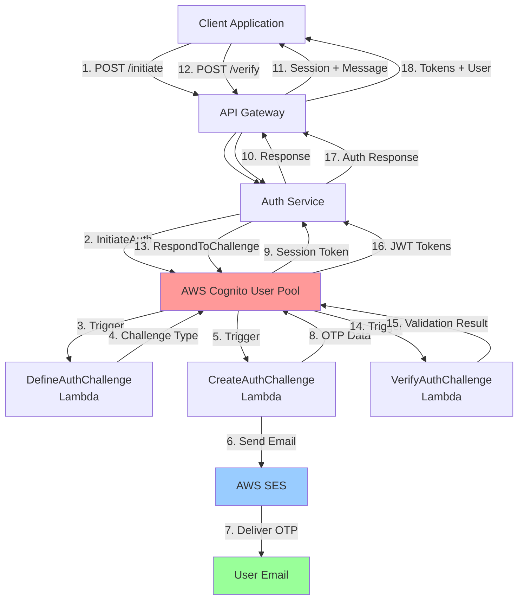

# Passwordless Authentication Architecture

## System Overview

The passwordless authentication system uses AWS Cognito's custom authentication flow with Lambda triggers to implement secure, email-based authentication without requiring users to create or remember passwords.

## Architecture Diagram



## Component Breakdown

### 1. Client Application
- Initiates authentication requests
- Handles user input (email, OTP)
- Stores and manages JWT tokens
- Makes authenticated API requests

### 2. API Gateway (NestJS)
- **Route**: `/auth/passwordless/*`
- **Controller**: `AuthController`
- **Service**: `AuthService`
- Handles HTTP requests/responses
- Validates input parameters
- Manages error responses

### 3. AWS Cognito User Pool
- **Purpose**: Identity management and JWT token issuance
- **Configuration**:
  - Custom authentication flow enabled
  - No password requirements
  - Email as username
  - Lambda triggers configured

**User Pool Settings:**
```json
{
  "ExplicitAuthFlows": [
    "ALLOW_CUSTOM_AUTH",
    "ALLOW_ADMIN_USER_PASSWORD_AUTH",
    "ALLOW_USER_SRP_AUTH", 
    "ALLOW_REFRESH_TOKEN_AUTH"
  ],
  "LambdaConfig": {
    "DefineAuthChallenge": "gdec-cognito-auth-define-auth-challenge",
    "CreateAuthChallenge": "gdec-cognito-auth-create-auth-challenge",
    "VerifyAuthChallengeResponse": "gdec-cognito-auth-verify-auth-challenge-response"
  }
}
```

### 4. Lambda Functions

#### DefineAuthChallenge
**Purpose**: Determines the authentication flow and challenge types

```javascript
exports.handler = async (event) => {
    const { request, response } = event;
    
    if (request.session.length === 0) {
        // First attempt - issue custom challenge
        response.challengeName = 'CUSTOM_CHALLENGE';
        response.issueTokens = false;
        response.failAuthentication = false;
    } else if (request.session.length === 1 && 
               request.session[0].challengeResult === true) {
        // Challenge passed - issue tokens
        response.issueTokens = true;
        response.failAuthentication = false;
    } else {
        // Challenge failed
        response.issueTokens = false;
        response.failAuthentication = true;
    }
    
    return event;
};
```

#### CreateAuthChallenge  
**Purpose**: Generates OTP and sends email via SES

```javascript
exports.handler = async (event) => {
    if (request.challengeName === 'CUSTOM_CHALLENGE') {
        const otp = generateOTP(); // 6-digit code
        const email = request.userAttributes.email;
        
        // Send email via SES
        await sendEmailOTP(email, otp);
        
        // Store OTP in challenge parameters
        response.privateChallengeParameters = { otp };
        response.publicChallengeParameters = { email };
        response.challengeMetadata = 'EMAIL_OTP_CHALLENGE';
    }
    
    return event;
};
```

#### VerifyAuthChallengeResponse
**Purpose**: Validates user's OTP input

```javascript
exports.handler = async (event) => {
    const userOTP = request.challengeAnswer;
    const correctOTP = request.privateChallengeParameters?.otp;
    
    response.answerCorrect = (userOTP === correctOTP);
    
    return event;
};
```

### 5. AWS SES (Simple Email Service)
- **Purpose**: Reliable email delivery
- **Configuration**: Domain verified (`greatdealscorp.com`)
- **Features**: HTML + text email templates
- **Monitoring**: Delivery statistics and bounce handling

### 6. Email Template
Professional HTML email with embedded OTP:

```html
<div style="background-color: #007bff; color: white; font-size: 32px; 
            font-weight: bold; padding: 20px; border-radius: 8px; 
            letter-spacing: 8px;">
    ${otp}
</div>
```

## Data Flow

### Authentication Initiation Flow

```sequence
participant C as Client
participant A as API Gateway  
participant S as Auth Service
participant CG as Cognito
participant L1 as DefineAuthChallenge
participant L2 as CreateAuthChallenge
participant SES as AWS SES
participant E as Email

C->>A: POST /auth/passwordless/initiate {email}
A->>S: initiatePasswordlessSignIn()
S->>S: ensureUserExists()
S->>CG: InitiateAuth(CUSTOM_AUTH)
CG->>L1: DefineAuthChallenge trigger
L1->>CG: challengeName: CUSTOM_CHALLENGE
CG->>L2: CreateAuthChallenge trigger  
L2->>L2: generateOTP()
L2->>SES: SendEmail(otp)
SES->>E: Deliver OTP email
L2->>CG: privateChallengeParameters: {otp}
CG->>S: session token
S->>A: {message, session}
A->>C: Success response
```

### Verification Flow

```sequence
participant C as Client
participant A as API Gateway
participant S as Auth Service  
participant CG as Cognito
participant L3 as VerifyAuthChallenge

C->>A: POST /auth/passwordless/verify {email, code, session}
A->>S: verifyPasswordlessCode()
S->>CG: RespondToAuthChallenge(code)
CG->>L3: VerifyAuthChallengeResponse trigger
L3->>L3: Compare OTP codes
L3->>CG: answerCorrect: true/false
CG->>S: JWT tokens (if valid)
S->>A: {accessToken, refreshToken, user}
A->>C: Authentication success
```

## Security Architecture

### 1. Authentication Security
- **No Password Storage**: System never stores or requires passwords
- **OTP Expiration**: 5-minute expiration on verification codes
- **Session Expiration**: Short-lived authentication sessions
- **Email Verification**: Only email owners can authenticate

### 2. Token Security
- **JWT Standards**: Industry-standard JSON Web Tokens
- **RSA Signing**: Cryptographically signed tokens
- **Token Expiration**: Configurable expiration times
- **Refresh Mechanism**: Secure token refresh without re-authentication

### 3. Rate Limiting
- **Cognito Built-in**: AWS Cognito provides rate limiting
- **Lambda Throttling**: Function-level rate limiting
- **SES Limits**: Email sending rate limits

### 4. Data Protection
- **In-Transit**: HTTPS/TLS encryption
- **At-Rest**: AWS encryption for stored data
- **PII Handling**: Minimal personal data storage

## Error Handling Strategy

### Client-Side Errors (4xx)
- **400 Bad Request**: Invalid input parameters
- **401 Unauthorized**: Authentication failures
- **429 Too Many Requests**: Rate limiting

### Server-Side Errors (5xx)
- **500 Internal Server Error**: Lambda function failures
- **502 Bad Gateway**: Cognito service issues
- **503 Service Unavailable**: SES delivery problems

### Error Response Format
```json
{
  "statusCode": 401,
  "message": "Invalid verification code",
  "error": "Unauthorized",
  "timestamp": "2025-06-10T02:50:41.019Z",
  "path": "/auth/passwordless/verify"
}
```

## Monitoring and Observability

### 1. CloudWatch Metrics
- Lambda function invocations
- Lambda function errors
- Lambda function duration
- SES sending statistics

### 2. Logging Strategy
```typescript
// Application logs
this.logger.log(`Initiating passwordless sign-in for ${email}`);
this.logger.error('Error details:', {
  name: error.name,
  message: error.message,
  code: error.$metadata?.httpStatusCode,
  requestId: error.$metadata?.requestId
});

// Lambda logs  
console.log('CreateAuthChallenge event:', JSON.stringify(event, null, 2));
console.log(`OTP for ${email}: ${otp}`);
```

### 3. Key Metrics to Monitor
- Authentication success rate
- Email delivery rate  
- OTP validation accuracy
- Session token usage
- Error rates by type

## Scalability Considerations

### 1. Stateless Design
- No server-side session storage
- Lambda functions are stateless
- Cognito handles session management

### 2. AWS Service Limits
- **Cognito**: 10,000 requests/second per user pool
- **Lambda**: 1,000 concurrent executions (default)
- **SES**: 14 emails/second (initially, can be increased)

### 3. Performance Optimization
- Lambda cold start mitigation
- Connection pooling for AWS services
- Efficient OTP generation
- Minimal email template size

## Development Environment

### Local Setup
```bash
# Environment variables
AWS_COGNITO_REGION=ap-southeast-1
AWS_COGNITO_USER_POOL_ID=ap-southeast-1_EspHylUJG
AWS_COGNITO_CLIENT_ID=tdb44tfpqp7heos7h2chn0ls5

# Start development server
npm run start:dev
```

### Testing Strategy
1. **Unit Tests**: Individual function testing
2. **Integration Tests**: End-to-end authentication flow
3. **Load Tests**: Concurrent authentication attempts
4. **Email Tests**: SES delivery verification

## Production Deployment

### 1. Infrastructure as Code
```bash
# Deploy Lambda functions
./scripts/setup-custom-auth.sh

# Configure Cognito triggers  
aws cognito-idp update-user-pool \
  --user-pool-id $USER_POOL_ID \
  --lambda-config DefineAuthChallenge=$LAMBDA_ARN
```

### 2. Environment Configuration
- Production AWS credentials
- SES domain verification
- CloudWatch log retention
- Error alerting setup

### 3. Security Hardening
- VPC configuration for Lambda
- IAM role least privilege
- SES DKIM/SPF configuration
- Rate limiting tuning

## Future Enhancements

### 1. Multi-Factor Authentication
- SMS backup option
- TOTP app integration
- Hardware token support

### 2. Advanced Features
- Remember device functionality
- Social login integration
- Administrative user management

### 3. Performance Improvements
- Lambda layer optimization
- Email template caching
- Connection pooling

---

This architecture provides a secure, scalable, and maintainable passwordless authentication system built on AWS serverless technologies.
